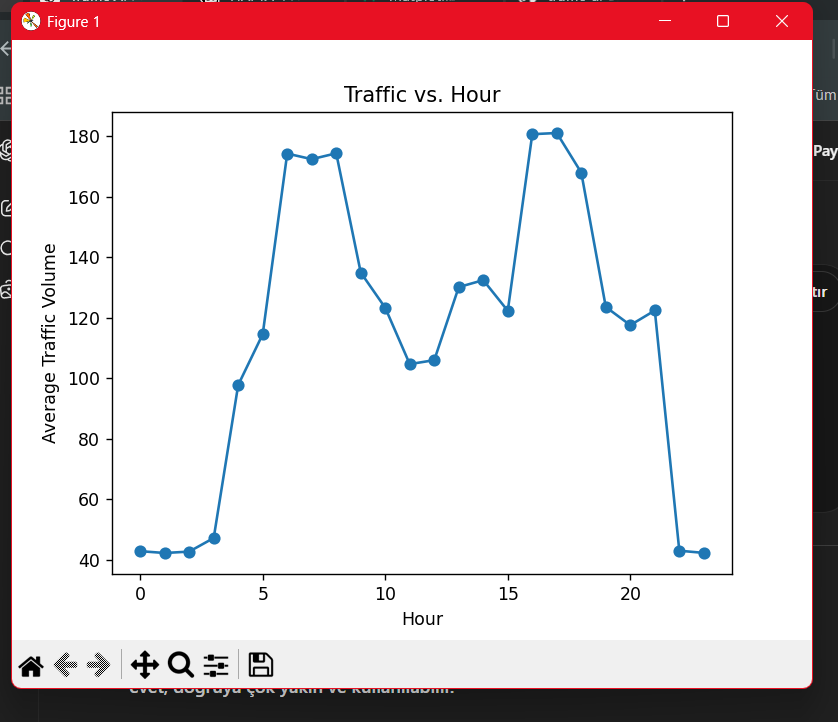
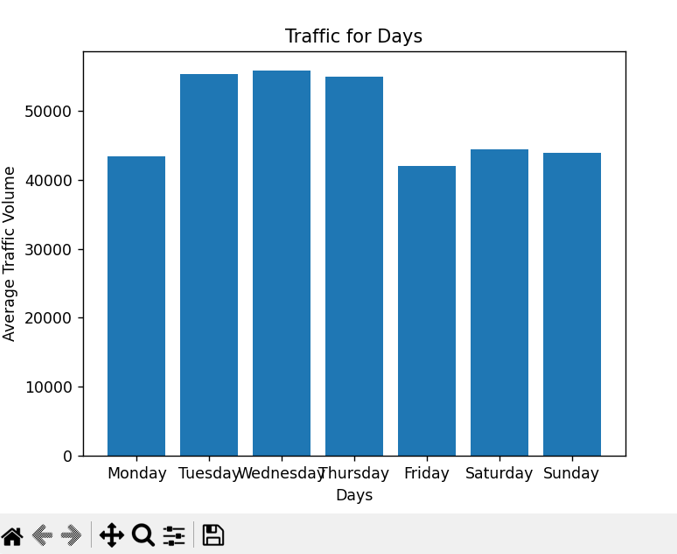
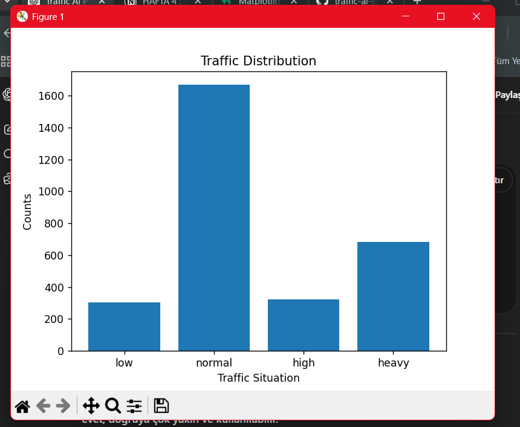

# 🚀 AI City Traffic Intelligence System
*(Şehir Trafik Zeka Sistemi)*


Bu proje, şehir içi trafik verilerini analiz ederek trafik yoğunluğunu tahmin eden ve risk seviyesini belirleyen bir yapay zeka sistemidir.

---

## 🎯 Projenin Amacı

- Trafik yoğunluğunu analiz etmek  
- Gün ve saat bazlı trafik değişimini incelemek  
- En yoğun saatleri belirlemek  
- Yapay zeka ile trafik tahmini yapmak  
- Trafik risk seviyesini belirlemek  

---

## 📊 Kullanılan Dataset

Traffic Prediction Dataset  
https://www.kaggle.com/datasets/hasibullahaman/traffic-prediction-dataset  

İçerik:

- saat  
- trafik hacmi  
- araç sayıları (car, bike, bus, truck)  
- trafik durumu (low, normal, high, heavy)  

---

## 📂 Proje Yapısı

```
traffic-ai-system/
├── data/
│   └── traffic.csv
├── src/
│   ├── data_loader.py
│   ├── preprocessing.py
│   ├── feature_engineering.py
│   ├── visualization.py
│   ├── traffic_model.py
│   └── risk_analyzer.py
├── models/
│   └── traffic_model.h5
├── main.py
│
└── README.md
```

---

## ⚙️ Teknolojiler

- Python  
- Pandas  
- Matplotlib  
- TensorFlow / Keras  
- Scikit-learn  

---

## 📊 Veri Analizi

### 🔹 Saat Bazlı Trafik


- Sabah ve akşam saatlerinde yoğunluk artar  
- Gece saatlerinde trafik minimum seviyededir  

👉 Bu durum klasik **rush hour pattern** ile uyumludur  

---

### 🔹 Gün Bazlı Trafik


- Hafta içi trafik daha yoğundur  
- Hafta sonu nispeten düşüş görülür  

👉 Özellikle Cuma ve hafta başı günlerinde artış dikkat çeker  

---

### 🔹 Trafik Dağılımı


- Veri setinde `normal` sınıf baskındır  
- `high` ve `low` daha azdır  

👉 Bu durum modelin bazı sınıflara daha yatkın öğrenmesine neden olabilir 

Bu grafikler sayesinde:
- yoğun saatler  
- gün bazlı değişimler  
- veri dağılımı  

analiz edilmiştir. 

---

## 🧠 Feature Engineering

Model performansını artırmak için:

- hour → saat bilgisi  
- day_of_week → günün sayısal karşılığı  
- is_weekend → hafta sonu kontrolü  

özellikleri oluşturulmuştur.

---

## 🤖 Model

Model, geçmiş trafik verilerini kullanarak trafik yoğunluğunu tahmin eder.

Model yapısı:

- Dense (64, ReLU)  
- Dense (32, ReLU)  
- Dense (1)  

Model ayarları:

- Optimizer: Adam  
- Loss: MSE  
- Metric: MAE  

Eğitilen model:

'''
models/traffic_model.h5
'''

dosyasına kaydedilir.

---

## 📈 Model Davranışı

Model:

- düşük saatlerde düşük trafik  
- yoğun saatlerde yüksek trafik  

tahmin etmeyi öğrenmiştir.

Bu, modelin **zaman bağımlı patternleri başarıyla yakaladığını** gösterir.

---

## 🔥 Risk Analyzer

Model çıktısı doğrudan yorumlanabilir değildir.  
Bu yüzden ek bir risk sistemi oluşturulmuştur:

### Risk Kuralları

| Trafik Değeri | Risk   |
|---------------|--------|
| < 60          | LOW    |
| 60 - 110      | NORMAL |
| 110 - 150     | HIGH   |
| > 150         | HEAVY  |


---

## 🧪 Örnek Çıktı

```
AI Prediction

Saat: 1
Gün: Saturday

AI tahmin:
Traffic Volume -> 30.65

Risk -> LOW TRAFFIC RISK
```

---

## 🔄 Sistem Akışı

```
Veri Yükleme
↓
Feature Engineering
↓
Veri Analizi
↓
Model Eğitimi
↓
Tahmin
↓
Risk Analizi
↓
Model Kaydetme
```

---

## 🎯 Sonuç

Bu proje şunları başarıyla göstermektedir:

- Trafik verisinin zaman bağımlı yapısı
- Yapay zeka ile trafik tahmini
- Model çıktısının yorumlanabilir hale getirilmesi

Bu sistem, gerçek şehirlerde trafik analizi ve risk tahmini için temel bir yapı sunar.

---
